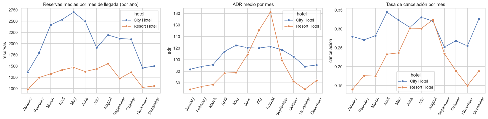
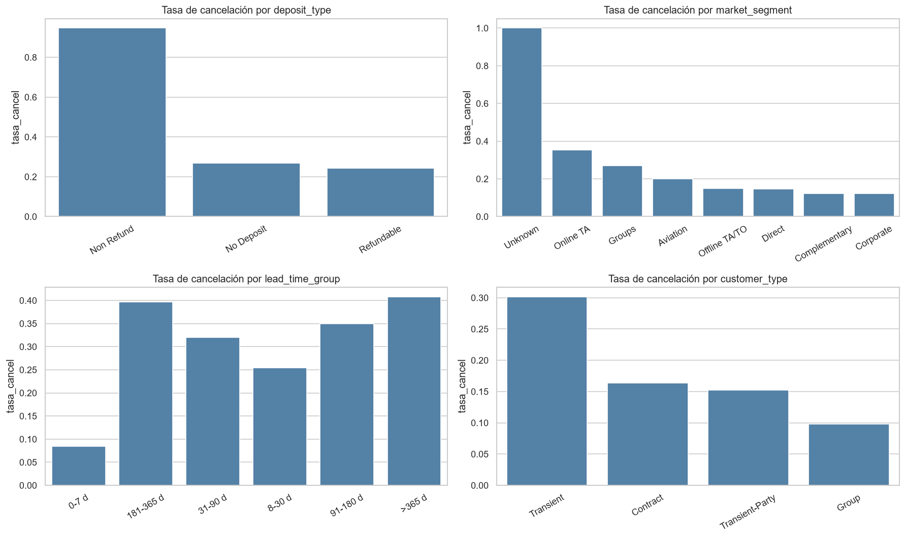
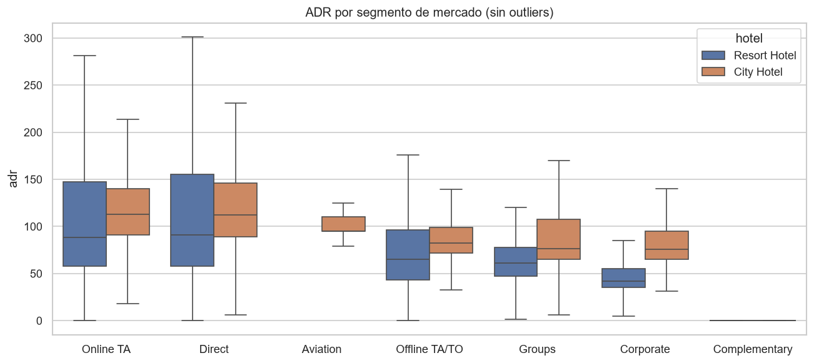
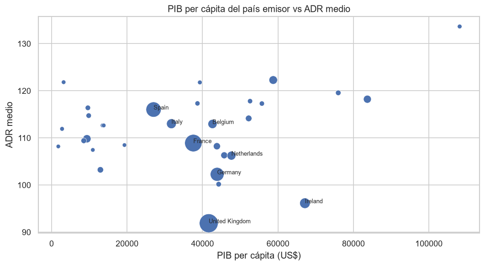

# MDAThePower_FinalProyect
# 🏨 Reservas hoteleras y contexto económico: EDA y dashboard

*Proyecto final del Máster en Data Analytics: qué explica la demanda, el precio y las cancelaciones de dos hoteles, y qué papel juega el país de origen del cliente.*

---

## 📖 Descripción

Este proyecto analiza **87.228 reservas** de dos hoteles de Portugal, un hotel urbano (*City Hotel*) y un resort (*Resort Hotel*), con llegadas entre julio de 2015 y agosto de 2017. Las reservas se enriquecen con **indicadores socioeconómicos del Banco Mundial** del país de origen de cada cliente.

**Objetivo:** responder cuatro preguntas de negocio:

1. ¿Cómo se comportan la demanda y el precio (ADR) a lo largo del año?
2. ¿Qué factores están asociados a la cancelación de una reserva?
3. ¿Qué canales y segmentos aportan más volumen y más valor?
4. ¿Influye el país de origen, y su nivel de renta, en el gasto y el comportamiento de reserva?

**Técnicas:** limpieza y transformación con Pandas, unión de fuentes, análisis descriptivo, contrastes de hipótesis no paramétricos con tamaño del efecto, visualización con Matplotlib y Seaborn, y un dashboard interactivo en Excel.

---

## 🗃️ Fuentes de datos

| Fuente | Contenido | Tamaño original |
|---|---|---|
| [Hotel Booking Demand](https://www.kaggle.com/datasets/jessemostipak/hotel-booking-demand) (Kaggle) | Reservas con fechas, antelación, ADR, canal, segmento, tipo de cliente, depósito, país… | 119.390 filas × 32 columnas |
| [World Development Indicators](https://data.worldbank.org/) (Banco Mundial) | PIB per cápita (`NY.GDP.PCAP.CD`), población (`SP.POP.TOTL`), inflación (`FP.CPI.TOTL.ZG`), salidas turísticas internacionales (`ST.INT.DPRT`), y región y nivel de renta por país | 4 indicadores + metadatos de país |

**Clave de unión:** código de país ISO3 + año de llegada.

**Dataset final:** 87.228 filas × 52 columnas (`data/processed/hotel_bookings_wb.csv`).

---

## 🗂️ Estructura del proyecto

```
├── data/
│   ├── raw/
│   │   ├── hotel_bookings.csv          # Fuente 1: Kaggle
│   │   └── banco_mundial/              # Fuente 2: 4 indicadores + metadatos de país
│   └── processed/
│       ├── hotel_bookings_wb.csv       # Dataset final limpio y unido
│       └── hotel_bookings_wb.xlsx      # Mismo dataset en Excel
├── notebooks/
│   ├── 01_limpieza_union.ipynb         # Limpieza, transformación y unión
│   └── 02_eda.ipynb                    # Análisis descriptivo, estadístico y visualización
├── results/
│   └── figures/                        # Gráficos generados por el EDA
├── dashboard/
│   └── dashboard_hoteles.xlsx          # Dashboard interactivo en Excel
├── requirements.txt
└── README.md
```

---

## 🛠️ Instalación y requisitos

El proyecto usa **Python 3.12+** y estas librerías: pandas, numpy, matplotlib, seaborn, scipy, openpyxl y jupyter.

```bash
git clone https://github.com/<tu-usuario>/<nombre-del-repo>.git
cd <nombre-del-repo>
python -m venv .venv
# Windows: .venv\Scripts\activate  |  Mac/Linux: source .venv/bin/activate
python -m pip install -r requirements.txt
```

**Orden de ejecución:**

1. `notebooks/01_limpieza_union.ipynb`: genera `data/processed/`.
2. `notebooks/02_eda.ipynb`: genera `results/figures/`.
3. `dashboard/dashboard_hoteles.xlsx`: se abre directamente en Excel.

---

## 🔧 Proceso seguido

### 1. Limpieza y transformación

| Paso | Decisión | Impacto |
|---|---|---|
| Duplicados exactos | Eliminados. El dataset no tiene ID de reserva, así que se opta por la vía conservadora para no inflar recuentos ni ingresos (parámetro `ELIMINAR_DUPLICADOS`) | −31.994 filas (26,8 %) |
| Registros inválidos | Eliminadas las reservas sin huéspedes, con ADR negativo o con ADR > 1.000 (un único valor de 5.400) | −168 filas |
| Nulos | `children` → 0; `country` → `UNK`; `agent` → `Sin agente`; `company` (94 % nulos) → indicador binario `has_company` | 0 nulos en las variables de reserva |
| Categorías | `meal`: `Undefined` = `SC` (sin régimen, según la documentación). `Undefined` → `Unknown` en segmento y canal | Categorías coherentes |
| Países | `TMP` → `TLS` (código antiguo de Timor Oriental). `CN` → `CAN` (**supuesto**: China ya figura como `CHN` y Canadá no aparece con su código ISO3) | Mejor cruce con el Banco Mundial |
| Variables nuevas | Fecha de llegada, fecha de reserva, noches totales, huéspedes, familia, cambio de habitación, mercado doméstico, temporada, tramo de antelación, ingreso estimado e ingreso realizado | +14 columnas |

### 2. Unión con el Banco Mundial

Los CSV del Banco Mundial vienen en formato ancho, con una columna por año desde 1960. Se transforman a formato largo (país-año), se filtran los años 2015-2017, se pivotan por indicador y se añaden región y nivel de renta. Se descartan los agregados como "Mundo" o "UE".

La unión es un *left join* por país y año: **solo el 0,58 % de las reservas** queda sin datos del Banco Mundial (territorios como Taiwán o Jersey, y los países desconocidos).

### 3. Análisis

El análisis incluye estadística descriptiva (KPIs, distribuciones, asimetría y curtosis), estacionalidad, factores de cancelación, rendimiento por canal y análisis por país.

El ADR no sigue una distribución normal (test de D'Agostino-Pearson, p < 0,001), así que se usan **contrastes no paramétricos**: χ² de independencia con V de Cramér, Mann-Whitney U, Kruskal-Wallis y correlación de Spearman. Con muestras tan grandes casi todo resulta significativo, por lo que **se reporta siempre el tamaño del efecto**.

---

## 📊 Resultados y conclusiones

### Estacionalidad y precio



- El **Resort** es muy estacional: su ADR medio pasa de unos 49 en invierno a unos 182 en agosto. El **City** es estable, entre 83 y 125.
- El ADR mediano del City (102) supera al del Resort (74). La diferencia es significativa (Mann-Whitney, p < 0,001; r = 0,30, efecto moderado).
- **Sesgo evitado:** julio y agosto aparecen en 3 años del dataset y el resto de meses en 2. Con el total de reservas, el City parecía tener su pico en agosto; con la media por año, su pico real es **mayo**.

### Cancelaciones: 27,5 % global (City 30,1 % · Resort 23,5 %)



- **La antelación es el factor más asociado** (V de Cramér = 0,24). Se cancela el 8 % de las reservas hechas con 0-7 días de antelación frente al 40 % de las que superan 180 días. La antelación mediana es de 80 días en las canceladas y de 38 en las que no se cancelan.
- **El segmento también pesa** (V = 0,22). Online TA cancela el 35 %, mientras que Direct y Offline TA/TO cancelan en torno al 15 %.
- Los **clientes repetidores** cancelan el 8 %, frente al 28 % del resto.
- ⚠️ **Anomalía:** las reservas *Non Refund* cancelan el 95 %. Es contraintuitivo y apunta a cómo registra el hotel estas reservas, no a un comportamiento del cliente.
- ⚠️ `room_changed` está muy asociada a la cancelación, pero no sirve como predictor: la habitación se asigna en el check-in, así que es información posterior a la reserva.

### Canales y segmentos



- **Online TA** genera el 59 % de las reservas y el 56 % del ingreso realizado, pero es el segmento que más cancela.
- **Direct** tiene el mismo ADR que Online TA (115) con menos de la mitad de cancelaciones. **Es el canal más rentable por reserva.**
- El segmento explica una parte relevante de la variación del ADR (Kruskal-Wallis, ε² = 0,18).

### País de origen y contexto económico



- **Portugal** (mercado doméstico) aporta el 31 % de las reservas y cancela el 36 %, muy por encima de los principales mercados europeos (Reino Unido, Francia y Alemania, en torno al 19-20 %).
- **El PIB per cápita del país emisor no se correlaciona con el ADR** (Spearman ρ = 0,18, p = 0,31, 32 países). **Sí se correlaciona con la antelación** (ρ = 0,64, p < 0,001): los mercados más ricos reservan con más tiempo.

### Recomendaciones para el negocio

1. **Impulsar el canal directo:** ofrece el mismo precio que las OTA con la mitad de cancelaciones y sin comisión de intermediación.
2. **Gestionar el riesgo de las reservas con mucha antelación y de Online TA**, por ejemplo con políticas de depósito o *overbooking* controlado basado en la tasa de cancelación esperada.
3. **Fidelizar:** los repetidores cancelan tres veces menos.
4. **Revisar el registro de las reservas *Non Refund***, porque sus datos no reflejan lo que su nombre indica.

---

## 📈 Dashboard

`dashboard/dashboard_hoteles.xlsx` es un dashboard interactivo en Excel con:

- **Filtros** por hotel, año, segmento y región del país emisor.
- **6 KPIs:** reservas, tasa de cancelación, ADR medio, estancia media, antelación media e ingreso realizado.
- **Gráficos** de estacionalidad, cancelación por antelación y por segmento, ingreso por segmento y los 10 principales mercados.
- **Tabla de contexto económico** por nivel de renta del país emisor.

Todos los valores se calculan con fórmulas (`COUNTIFS`, `AVERAGEIFS`, `SUMIFS`) sobre la hoja de datos, así que el panel se actualiza al cambiar los filtros. La hoja *Notas* documenta definiciones y supuestos.

---

## 🔄 Próximos pasos

- Construir un **modelo predictivo de cancelación** (regresión logística o *gradient boosting*) excluyendo las variables *a posteriori*.
- Validar el supuesto `CN` = Canadá con la fuente original del dataset.
- Incorporar variables externas (festivos, eventos, meteorología) para explicar mejor la demanda.
- Analizar la evolución del ADR descontando la inflación del país emisor.

---

## 📝 Supuestos y limitaciones

- La fuente no especifica la moneda del ADR.
- El ingreso es una **estimación**: ADR × noches de las reservas no canceladas.
- El periodo no cubre años naturales completos, así que no se comparan totales anuales.
- Al eliminar duplicados podrían haberse descartado reservas reales de grupos con características idénticas.

---

## 🤝 Contribuciones

Las contribuciones son bienvenidas. Para proponer mejoras, abre una *issue* o un *pull request*.

---

## ✒️ Autor

- Eugenio Zustovich
- [@<tu-usuario>](https://github.com/<tu-usuario>)

**Fuentes:** Antonio, N., de Almeida, A. y Nunes, L. (2019). *Hotel booking demand datasets*. Data in Brief, 22, 41-49 (vía Kaggle). World Bank, *World Development Indicators*.
